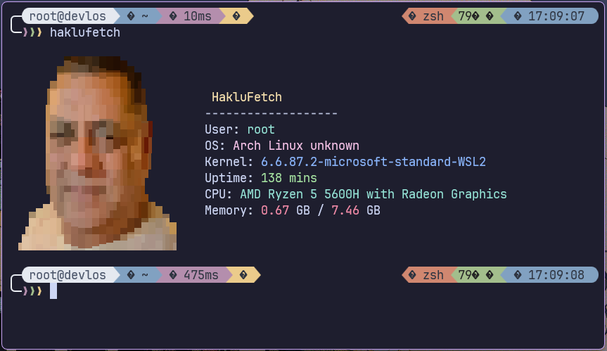
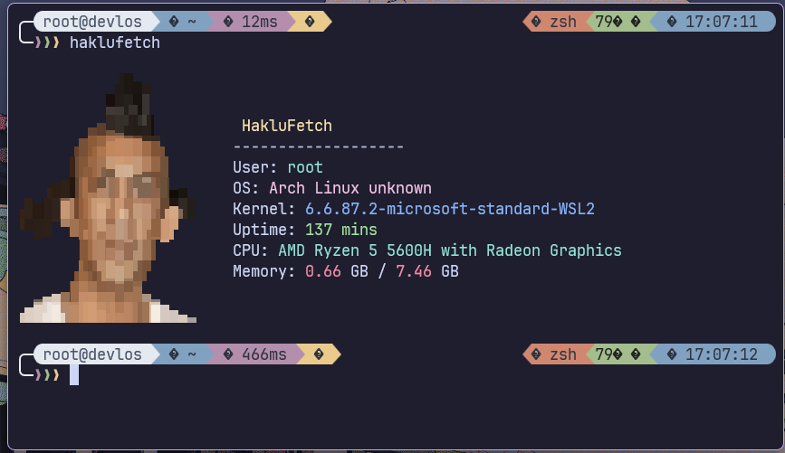
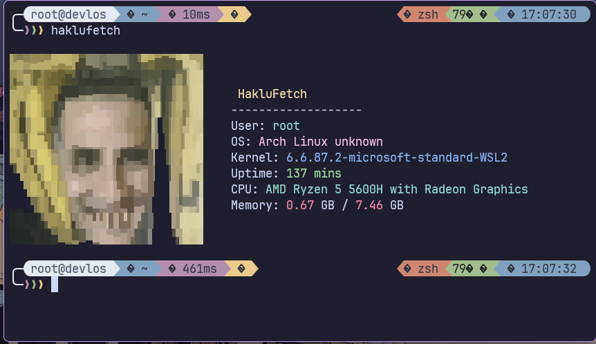
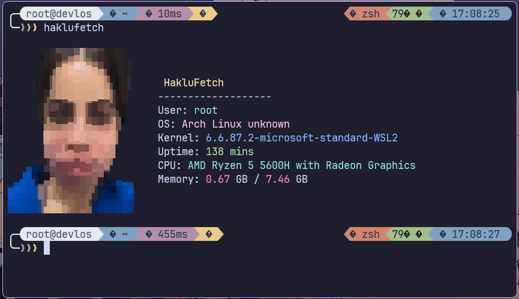

<h1 align="center">haklufetch</h1>

<p align="center">
haklufetch — like neofetch but with way more ✨brainrot✨. get your system info and lose braincells at the same time.
</p>

<div align="center">
  
</div>

<br>

---

## Installation

#### One-time run

```bash
npx haklufetch
```

#### Permanent installation

```bash
npm install -g haklufetch

# Now you can run:
haklufetch
```

### Local installation

```bash
# Clone the repository
git clone https://github.com/devlos_/haklufetch.git
cd haklufetch
npm i

# Make it Executable
chmod +x index.js

# Link the package
npm link

# Local run haklufetch
haklufetch
```

## Display Examples

|  |  |
| ------------------------------ | ------------------------------ |
|  |  |
